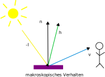

Im Gegensatz zum klassischen Phong-Modell basiert PBR auf messbaren physikalischen Prinzipien. Die drei zentralen Säulen sind:

- **Energieerhaltung**
- **Fresnel-Effekt**
- **Mikrofacettentheorie**

Diese Prinzipien führen zu realistischen und unter verschiedenen Beleuchtungsbedingungen konsistenten Materialdarstellungen.

---

# Grundlagen

## Rendering-Gleichung

Die Grundlage jeder Beleuchtungsberechnung ist die **Rendering-Gleichung**:

$$
L_o(x,\omega_o) = L_e(x,\omega_o) + \int_{\Omega} f_r(x,\omega_i,\omega_o) \, L_i(x,\omega_i) \, (n \cdot \omega_i) \, d\omega_i
$$

Dabei beschreibt die **Bidirectional Reflectance Distribution Function (BRDF)** $f_r$ das Reflexionsverhalten der Oberfläche für einfallendes Licht aus Richtung $\omega_i$ in Richtung $\omega_o$.

In PBR wird die BRDF üblicherweise in zwei Anteile aufgeteilt:

$$
f_r(\mathbf{v}, \mathbf{l}) = f_d(\mathbf{v}, \mathbf{l}) + f_s(\mathbf{v}, \mathbf{l})
$$

- $f_d$: **diffuser Anteil** (matte, richtungsunabhängige Reflexion)
- $f_s$: **spekularer Anteil** (gerichtete Spiegelreflexion)

Der diffuse Anteil wird meist mit einem normierten Lambert-Modell berechnet, der spekularer Anteil mit der Cook-Torrance-BRDF.

---

# Energieerhaltung

## Grundprinzip

Eine Oberfläche darf **nie mehr Licht reflektieren, als sie empfängt**. Die Summe aus diffusem und spiegelndem Anteil muss physikalisch plausibel bleiben.

**Vergleich mit Phong:**  
Im klassischen Phong-Modell werden Ambient, Diffuse und Specular einfach addiert. Dadurch ist es möglich, dass die reflektierte Energie die einfallende übersteigt – das Material leuchtet dann unnatürlich. In PBR wird diese Verletzung der Energieerhaltung durch die Abhängigkeit der Anteile voneinander systematisch verhindert.

---

# Mikrofacettentheorie

## Grundidee

Reale Oberflächen sind auf mikroskopischer Ebene rau und bestehen aus vielen kleinen Facetten, die wie winzige Spiegel wirken. Nur Facetten, deren Normale exakt dem Halfway-Vektor $\mathbf{h}$ entspricht, reflektieren Licht direkt vom Licht zum Betrachter.

{width=300px}
{width=250px}
{width=250px}

v: Blickrichtungsvektor
l: Lichtrichtungsvektor
n: Normalenvektor
h: normierte Mittelrichtung zwischen v und l

## Cook-Torrance BRDF (spekularer Anteil)

Der spekularer Anteil $f_s$ in PBR wird mit der Cook-Torrance-Formel berechnet:

$$
f_s(\mathbf{v}, \mathbf{l}) = \frac{F(\mathbf{v}, \mathbf{h}) \, D(\mathbf{h}) \, G(\mathbf{l}, \mathbf{v})}{4 \, (\mathbf{n} \cdot \mathbf{l}) \, (\mathbf{n} \cdot \mathbf{v})}
$$ {#eq-cook-torrance}

Dieser Term setzt sich aus drei physikalisch begründeten Komponenten zusammen. Jede wird im Folgenden mit dem Phong-Modell verglichen.

### 1. Fresnel-Term $F$

Der **Fresnel-Effekt** beschreibt, dass der Reflexionsanteil mit flacherem Einfallswinkel zunimmt. Bei grazing angles reflektiert nahezu jedes Material fast das gesamte Licht spiegelnd.

In der Praxis wird meist die **Schlick-Approximation** verwendet:

$$
F(\theta) = F_0 + (1 - F_0)(1 - \cos\theta)^5
$$

**Vergleich mit Phong:**  
Das Phong-Modell kennt keinen Fresnel-Effekt. Das Glanzlicht hat bei jedem Betrachtungswinkel die gleiche Intensität – unabhängig davon, ob man senkrecht oder flach auf die Oberfläche schaut. Dies führt zu unnatürlich gleichmäßigen und oft zu hellen Glanzlichtern an den Rändern.

### 2. Normal Distribution Function (NDF) $D$

Die NDF beschreibt die statistische Verteilung der Mikrofacets. Der heutige Standard ist die **GGX (Trowbridge-Reitz)**-Verteilung:

$$
D(\mathbf{h}) = \frac{\alpha^2}{\pi \left( (\mathbf{n} \cdot \mathbf{h})^2 (\alpha^2 - 1) + 1 \right)^2}
$$

$\alpha$ entspricht der Roughness (0 = glatt, 1 = rau).

**Vergleich mit Phong:**  
Phong verwendet die einfache Potenzfunktion $(\mathbf{n} \cdot \mathbf{h})^S$. Diese hat keine physikalische Grundlage und ist nicht energieerhaltend. Wird das Glanzlicht breiter, bleibt die Helligkeit gleich oder nimmt sogar zu – physikalisch falsch.  
Bei GGX wird das Glanzlicht mit zunehmender Rauheit automatisch dunkler, weil die Funktion normiert ist und die Energieerhaltung einhält.

### 3. Geometry-Term $G$ (Shadowing & Masking)

Auf rauen Oberflächen verdecken sich Mikrofacets gegenseitig (Shadowing und Masking). Der Geometry-Term modelliert diese Abschattung und Blockierung.

In modernen PBR-Systemen wird meist die **Smith-Schlick-GGX**-Approximation verwendet:

$$
G_1(v) = \frac{\mathbf{n} \cdot \mathbf{v}}{(\mathbf{n} \cdot \mathbf{v})(1 - k) + k}
$$

Der volle Term lautet $G(\mathbf{l}, \mathbf{v}) = G_1(\mathbf{l}) \cdot G_1(\mathbf{v})$.

**Vergleich mit Phong:**  
Das Phong-Modell enthält keinen Geometry-Term. Dadurch entsteht bei flachen Betrachtungswinkeln ein unnatürlicher Helligkeitsanstieg an den Rändern („bright edges“). Der G-Term in PBR kompensiert diesen Effekt und hält die reflektierte Energie physikalisch plausibel.

---

# Der diffuse Anteil

Durch den Fresnel-Term ist bekannt, wie viel Licht spiegelnd reflektiert wird. Der verbleibende Anteil wird diffus gestreut:

$$
k_d = (1 - F) \cdot (1 - \text{metalness})
$$

**Vergleich mit Phong:**  
Im Phong-Modell sind Diffuse und Specular unabhängige Parameter. Man kann beide gleichzeitig auf hohe Werte setzen, sodass das Material mehr Licht reflektiert als es erhält. In PBR sind beide Anteile über die Energieerhaltung und den Fresnel-Term miteinander verknüpft. Metalle haben zudem praktisch keinen diffusen Anteil.

Für den diffusen Teil wird meist das normierte **Lambert-Modell** verwendet:

$$
f_{\text{diffuse}} = \frac{c}{\pi}
$$

Der Faktor $1/\pi$ stellt sicher, dass auch der diffuse Anteil die Energieerhaltung einhält.

---

# Zusammenspiel der Prinzipien

- Die **Mikrofacettentheorie** (über D und G) bestimmt die *Struktur* und Schärfe der Reflexion.
- Der **Fresnel-Effekt** (F) regelt die winkelabhängige Verteilung zwischen Spiegelung und Diffusion.
- Die **Energieerhaltung** stellt sicher, dass die Gesamtreflexion physikalisch plausibel bleibt.

Zusammen ermöglichen diese Prinzipien deutlich realistischere und konsistentere Materialien als das klassische Phong-Modell.

---