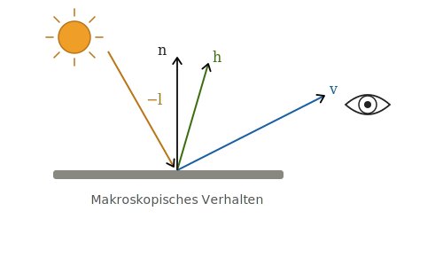
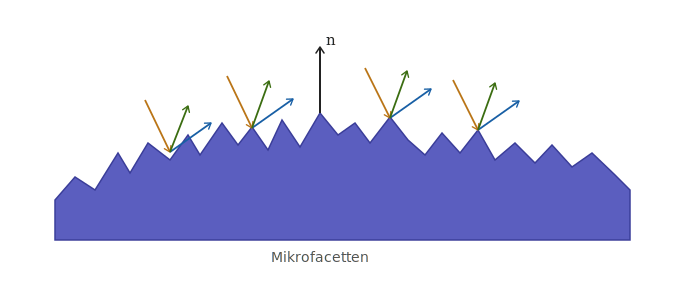

Im Gegensatz zum klassischen Phong-Modell basiert **Physically Based Rendering (PBR)** auf physikalisch motivierten Materialmodellen. Ziel ist es, das Reflexionsverhalten realer Oberflächen möglichst plausibel zu approximieren.

Die zentralen Prinzipien sind:

- **BRDF-basierte Materialbeschreibung**
- **Mikrofacettentheorie**
- **Fresnel-Effekt**
- **Energieerhaltung**

Diese Prinzipien führen zu realistischeren und unter unterschiedlichen Beleuchtungsbedingungen konsistenten Materialdarstellungen.

# Grundlagen

## Rendering-Gleichung

Die Grundlage moderner Beleuchtungsmodelle ist die Rendering-Gleichung:

$$
L_o(x,\omega_o)
=
L_e(x,\omega_o)
+
\int_{\Omega}
f_r(x,\omega_i,\omega_o)
\, L_i(x,\omega_i)
\, (n \cdot \omega_i)
\, d\omega_i
$$

Sie beschreibt den gesamten Lichttransport einer Szene.

Dabei bezeichnet:

- $L_o$: ausgehende Strahldichte (sichtbares Licht)
- $L_e$: selbst emittiertes Licht
- $L_i$: einfallendes Licht
- $f_r$: Reflexionsverhalten des Materials

Für die Darstellung eines Materials ist insbesondere der Term $f_r$ relevant.

## Die BRDF

Die **Bidirectional Reflectance Distribution Function (BRDF)** beschreibt, welcher Anteil des einfallenden Lichts aus Richtung $\omega_i$ in Richtung des Betrachters $\omega_o$ reflektiert wird.

Sie stellt damit das Materialmodell innerhalb der Rendering-Gleichung dar.

Während das klassische Phong-Modell eine empirische BRDF verwendet, nutzt PBR physikalisch motivierte BRDFs, die reale Materialeigenschaften besser approximieren.

In PBR wird die BRDF meist in einen diffusen und einen spekularen Anteil zerlegt:

$$
f_r(\omega_o,\omega_i)
=
f_d(\omega_o,\omega_i)
+
f_s(\omega_o,\omega_i)
$$

- $f_d$: diffuser Anteil
- $f_s$: spekularer Anteil

Der diffuse Anteil wird häufig mit dem Lambert-Modell beschrieben, der spekulare Anteil mit der Cook-Torrance-BRDF.

::: {.callout-note}
## Phong vs. PBR

Im Phong-Modell wird die Fragmentfarbe als Summe aus Ambient-, Diffuse- und Specular-Anteil berechnet:

$$
\text{Farbe}
=
\text{Ambient}
+
\text{Diffuse}
+
\text{Specular}
$$

PBR beschreibt Materialien dagegen über eine physikalisch motivierte BRDF, die direkt Bestandteil der Rendering-Gleichung ist.
:::

# Mikrofacettentheorie

## Grundidee

Reale Oberflächen erscheinen makroskopisch glatt, besitzen jedoch auf mikroskopischer Ebene eine raue Struktur. Diese kann als Ansammlung vieler kleiner Spiegel – sogenannter Mikrofacetten – modelliert werden.

Nur Mikrofacetten, deren Normale mit dem Halfway-Vektor $\mathbf{h}$ übereinstimmt, reflektieren Licht direkt vom Lichtstrahl zum Betrachter.

::: {style="display: flex; justify-content: center; align-items: center; gap: 1rem; margin: 1rem 0;"}

::: {style="text-align: center; flex: 0 0 auto;"}
{width=90%}
:::

::: {style="text-align: left; flex: 0 0 auto;"}
- $\mathbf{v}$: Blickrichtung
- $\mathbf{l}$: Lichtrichtung
- $\mathbf{n}$: Oberflächennormale
- $\mathbf{h}$: Halfway-Vektor
:::

:::

::: {style="display: flex; justify-content: center; margin: 1rem 0;"}

::: {style="text-align: center;"}
{width="460px"}
:::

:::


Die Mikrofacettentheorie bildet die Grundlage moderner spekularer Reflexionsmodelle in PBR.

# Cook-Torrance-BRDF

Der spekulare Anteil wird in modernen PBR-Systemen meist durch die **Cook-Torrance-BRDF** beschrieben:

$$
f_s(\mathbf{v}, \mathbf{l})
=
\frac{
F(\mathbf{v}, \mathbf{h})
\, D(\mathbf{h})
\, G(\mathbf{l}, \mathbf{v})
}
{
4
(\mathbf{n}\cdot\mathbf{l})
(\mathbf{n}\cdot\mathbf{v})
}
$$

Die Formel setzt sich aus drei physikalisch motivierten Komponenten zusammen:

- **Fresnel-Term $F$**
- **Normal Distribution Function (NDF) $D$**
- **Geometry-Term $G$**

## Fresnel-Term $F$

Der **Fresnel-Effekt** beschreibt, dass der Reflexionsanteil mit flacherem Betrachtungswinkel zunimmt.

Bei sehr flachen Blickwinkeln wird nahezu das gesamte Licht spiegelnd reflektiert. Deshalb erscheinen Wasserflächen oder Glasoberflächen am Horizont deutlich spiegelnder als bei senkrechter Betrachtung.

In Echtzeit-Anwendungen wird häufig die Schlick-Approximation verwendet:

$$
F(\theta)
=
F_0
+
(1-F_0)
(1-\cos\theta)^5
$$

Dabei bezeichnet $F_0$ die Basisreflektivität des Materials bei senkrechtem Einfall ($\theta = 0°$) – also den Anteil des Lichts, der reflektiert wird, wenn der Betrachter direkt auf die Oberfläche schaut. Dieser Wert ist materialspezifisch: Nichtmetalle (Dielektrika) haben typischerweise ein $F_0$ zwischen 0,02 und 0,08, während Metalle deutlich höhere Werte erreichen. Der Term $(1-\cos\theta)^5$ sorgt dafür, dass die Reflektivität mit zunehmendem Winkel $\theta$ – also flacherem Blickwinkel – stark ansteigt und bei streifendem Einfall gegen 1 konvergiert.

::: {.callout-note}
## Phong

Das Phong-Modell berücksichtigt keinen Fresnel-Effekt.

Die Intensität des Glanzlichts bleibt unabhängig vom Betrachtungswinkel nahezu gleich.
:::

## Normal Distribution Function (NDF) $D$

Die NDF beschreibt die statistische Verteilung der Mikrofacetten auf einer Oberfläche.

Eine häufig verwendete Verteilung ist die **GGX-Verteilung**:

$$
D(\mathbf{h})
=
\frac{\alpha^2}
{\pi
\left(
(\mathbf{n}\cdot\mathbf{h})^2
(\alpha^2-1)
+1
\right)^2}
$$

Der Parameter $\alpha$ entspricht dem Quadrat des Roughness-Werts und beschreibt die Oberflächenrauheit: bei kleinem $\alpha$ sind die meisten Mikrofacetten zur Makronormale ausgerichtet, was zu scharfen, konzentrierten Reflexionen führt; bei großem $\alpha$ streuen die Facettennormalen stärker, und das Highlight wird breiter und schwächer. Der Term $\mathbf{n}\cdot\mathbf{h}$ ist das Skalarprodukt zwischen der Makronormale und dem Halfway-Vektor – er misst, wie gut der Halfway-Vektor mit der mittleren Oberflächennormale übereinstimmt. Nur wenn $\mathbf{n}\cdot\mathbf{h}$ nahe bei 1 liegt, liefert die NDF einen hohen Wert.

- kleine Roughness → scharfe Reflexionen
- große Roughness → breite Reflexionen

::: {.callout-note}
## Phong

Phong verwendet für Glanzlichter die Potenzfunktion

$$
(\mathbf{n}\cdot\mathbf{h})^s
$$

Der Exponent $s$ steuert lediglich die Breite des Highlights und besitzt keine physikalische Bedeutung.
:::

## Geometry-Term $G$

Auf rauen Oberflächen können sich Mikrofacetten gegenseitig verdecken.

Dabei treten zwei Effekte auf:

- **Shadowing**: Facetten blockieren das einfallende Licht.
- **Masking**: Facetten verdecken reflektiertes Licht in Richtung des Betrachters.

Diese Effekte werden durch den Geometry-Term modelliert.

Eine häufig verwendete Approximation ist Smith-Schlick-GGX:

$$
G_1(v)
=
\frac{\mathbf{n}\cdot\mathbf{v}}
{
(\mathbf{n}\cdot\mathbf{v})(1-k)+k
}
$$

Dabei ist $\mathbf{n}\cdot\mathbf{v}$ das Skalarprodukt zwischen Normaler und Blickrichtung – ein Maß dafür, wie senkrecht der Betrachter auf die Fläche schaut. Bei flachen Winkeln wird dieser Wert klein, was die Abschattung verstärkt. Der Parameter $k$ leitet sich aus der Roughness ab und steuert, wie stark die Geometrie-Dämpfung einsetzt. $G_1$ berechnet den Abschattungsanteil für eine einzelne Richtung (Licht oder Betrachter).

Der vollständige Geometry-Term ergibt sich aus:

$$
G(\mathbf{l},\mathbf{v})
=
G_1(\mathbf{l})
\cdot
G_1(\mathbf{v})
$$

Das Produkt aus beiden Einzeltermen erfasst sowohl Shadowing (Lichtrichtung $\mathbf{l}$) als auch Masking (Blickrichtung $\mathbf{v}$) gleichzeitig. Da beide Effekte unabhängig voneinander auftreten können, werden sie multiplikativ kombiniert.

::: {.callout-note}
## Phong

Das Phong-Modell berücksichtigt weder Shadowing noch Masking zwischen Mikrofacetten.

Dadurch können Reflexionen bei flachen Winkeln unnatürlich hell erscheinen.
:::

# Der diffuse Anteil

Der Fresnel-Term bestimmt, welcher Anteil des Lichts spiegelnd reflektiert wird.

Der verbleibende Anteil steht für die diffuse Reflexion zur Verfügung:

$$
k_d = (1-F)(1-\text{metalness})
$$

Dabei ist:

- $F$: Fresnel-Term
- $k_d$: Gewichtungsfaktor des diffusen Anteils

Für die eigentliche diffuse BRDF wird meist das normierte Lambert-Modell verwendet:

$$
f_d = k_d \frac{c}{\pi}
$$

mit:

- $c$: Albedo (Grundfarbe des Materials)

Der Faktor $1/\pi$ sorgt dafür, dass die diffuse Reflexion energieerhaltend bleibt.

# Energieerhaltung

## Grundprinzip

Eine Oberfläche darf niemals mehr Licht reflektieren als sie empfängt.

$$
E_{\text{out}}
\le
E_{\text{in}}
$$

Die gesamte reflektierte Energie muss also kleiner oder gleich der eingestrahlten Energie sein.

::: {.callout-note}
## Phong

Im Phong-Modell können diffuse und spekulare Anteile unabhängig voneinander gewählt werden:
```text
Diffuse = 0.8
Specular = 0.8
```
Die Oberfläche reflektiert damit bereits 160 % des einfallenden Lichts.
Zusätzliche Anteile wie Ambient oder Emissive würden diesen Wert sogar noch weiter erhöhen.
Dies verletzt die Energieerhaltung und kann zu unnatürlich hellen Materialien führen.
:::

## Energieerhaltung in PBR

In PBR sind diffuser und spekularer Anteil nicht unabhängig voneinander.

Der Fresnel-Term bestimmt zunächst, welcher Anteil des Lichts spiegelnd reflektiert wird.

Der verbleibende Anteil steht anschließend für die diffuse Reflexion zur Verfügung:

$$
k_d
=
(1-F)
\cdot
(1-\text{metalness})
$$

Erhöht sich der spekulare Anteil, reduziert sich automatisch der diffuse Anteil.

Dadurch bleibt die Gesamtenergie stets physikalisch plausibel.

# Zusammenspiel der Prinzipien

Die drei zentralen Prinzipien von PBR greifen ineinander:

- Die **Mikrofacettentheorie** beschreibt die mikroskopische Struktur der Oberfläche.
- Der **Fresnel-Term** bestimmt die winkelabhängige Verteilung zwischen Spiegelung und Diffusion.
- Die **Energieerhaltung** stellt sicher, dass niemals mehr Licht reflektiert wird als eintrifft.

Gemeinsam bilden sie die Grundlage moderner PBR-Materialmodelle und ermöglichen deutlich realistischere Ergebnisse als das klassische Phong-Modell.

# Verständnischeck

<details>
<summary>Warum wird in PBR der Fresnel-Term verwendet?</summary>

Der Fresnel-Term beschreibt, dass der Reflexionsanteil vom Betrachtungswinkel abhängt.

Bei flachen Winkeln wird mehr Licht spiegelnd reflektiert als bei senkrechter Betrachtung. Dieser Effekt tritt bei nahezu allen realen Materialien auf und wird vom klassischen Phong-Modell nicht berücksichtigt.

</details>

<details>
<summary>Warum verwendet PBR die Mikrofacettentheorie?</summary>

Reale Oberflächen sind auf mikroskopischer Ebene nicht perfekt glatt.

Die Mikrofacettentheorie modelliert eine Oberfläche als Ansammlung vieler kleiner Facetten, wodurch realistische Glanzlichter und Reflexionen entstehen.

</details>

<details>
<summary>Warum verletzt das folgende Phong-Material die Energieerhaltung?</summary>

```text
Diffuse = 0.8
Specular = 0.8
```

Die Summe der reflektierten Anteile beträgt bereits 160 % des einfallenden Lichts.

Damit reflektiert die Oberfläche mehr Energie als sie erhält, was physikalisch unmöglich ist.

</details>

<details>
<summary>Welche Aufgabe hat die BRDF innerhalb der Rendering-Gleichung?</summary>

Die BRDF beschreibt das Reflexionsverhalten eines Materials.

Sie bestimmt, welcher Anteil des einfallenden Lichts aus einer Richtung in die Richtung des Betrachters reflektiert wird.

</details>
