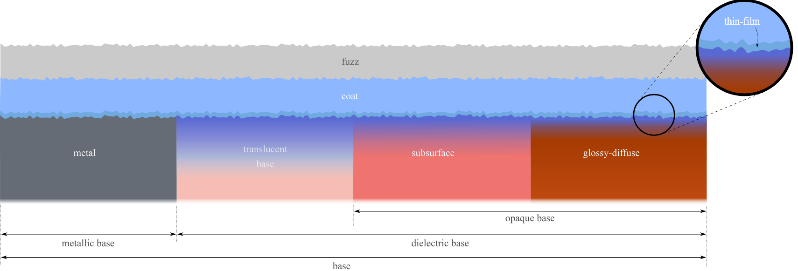
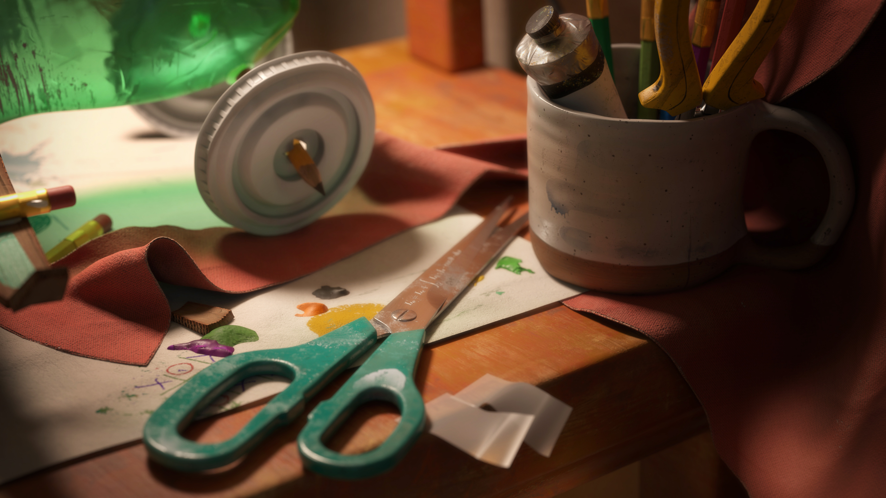
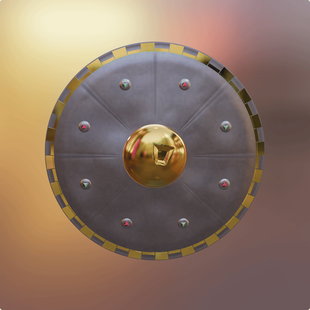

# Einleitung {background-color="#1f2937"}

## Agenda

::: {.incremental}
- **Problem & Motivation** *(Team)*
- **1 · Phong & seine Grenzen** *(Stefan)*
- **2 · PBR-Prinzipien** *(Celia)*
- **3 · Materialmodell** *(Alexander)*
- **4 · Image Based Lighting** *(Stefan)*
- **Vertiefung: Materialalterung** *(Alexander)*
- **Quiz & Diskussion** *(Team)*
:::

## Was ist PBR?

::: {.incremental}
- **Physically Based Rendering** simuliert die Interaktion von Licht und Material **physikalisch korrekt** — mathematisch approximiert
- Statt Lichteffekte visuell zu *schätzen* → echte physikalische Gesetze
- Zwei Grundpfeiler: **Mikrofacetten-Theorie** und **Energieerhaltung**
:::

## Warum brauchen wir das?

::: {.incremental}
- **Fotorealismus** — Industrie-Standard für moderne Echtzeitgrafik (Unreal, Unity) und Film
- **Physikalische Korrektheit** — ein Objekt reflektiert nie mehr Licht als es empfängt
- **Konsistenz** — ein einmal erstelltes Material wirkt unter *jeder* Beleuchtung plausibel
- **Intuitive Workflows** — Artists arbeiten mit *Roughness* und *Metallic*, nicht mit Specular-Exponenten
:::

## Das Ziel: Fotorealismus in Echtzeit

```{=html}
<canvas id="introGoldCanvas" style="width: 100%; height: 460px; border-radius: 8px; outline: none;"></canvas>
<p style="text-align: center; font-size: 0.55em; color: #888; margin-top: 6px;">
  Goldenes PBR-Material kombiniert mit Image Based Lighting — Vorgeschmack auf Sektion 3 + 4.
</p>
<script>
  (function() {
    const canvas = document.getElementById("introGoldCanvas");
    if (!canvas) return;
    const engine = new BABYLON.Engine(canvas, true, { adaptToDeviceRatio: true });
    const SUPERSAMPLE = 1.5;
    const updateScaling = () => {
      const rect = canvas.getBoundingClientRect();
      if (canvas.clientWidth > 0 && rect.width > 0) {
        const cssScale = rect.width / canvas.clientWidth;
        engine.setHardwareScalingLevel(1 / ((window.devicePixelRatio || 1) * cssScale * SUPERSAMPLE));
        engine.resize();
      }
    };
    updateScaling();
    [100, 500, 1500].forEach(ms => setTimeout(updateScaling, ms));
    window.addEventListener("resize", updateScaling);
    if (window.IntersectionObserver) {
      new IntersectionObserver(entries => {
        if (entries[0].isIntersecting) {
          updateScaling();
          setTimeout(updateScaling, 100);
        }
      }, { threshold: 0.1 }).observe(canvas);
    }
    if (window.Reveal && typeof Reveal.on === "function") {
      Reveal.on("slidechanged", updateScaling);
      Reveal.on("resize", updateScaling);
    }
    const scene = new BABYLON.Scene(engine);
    const camera = new BABYLON.ArcRotateCamera("camera", Math.PI / 2, Math.PI / 2.5, 4, BABYLON.Vector3.Zero(), scene);
    camera.attachControl(canvas, true);
    camera.minZ = 0.1;
    camera.wheelPrecision = 50;
    scene.createDefaultEnvironment({
      createSkybox: true,
      skyboxSize: 100,
      skyboxColor: new BABYLON.Color3(0.05, 0.05, 0.05),
      createGround: false
    });
    const sphere = BABYLON.MeshBuilder.CreateSphere("sphere", { diameter: 2, segments: 64 }, scene);
    const pbr = new BABYLON.PBRMaterial("pbr", scene);
    pbr.metallic = 1.0;
    pbr.roughness = 0.1;
    pbr.albedoColor = new BABYLON.Color3(1.0, 0.76, 0.33);
    sphere.material = pbr;
    engine.runRenderLoop(() => scene.render());
  })();
</script>
```

# 1 · Phong & seine Grenzen {background-color="#1f2937"}

## Einstieg — zwei Welten, eine Geometrie

::: {.fragment}
**Was wir gleich sehen:**
:::

::: {.incremental}
- Identische Form, identische Beleuchtungssituation
- Links: das klassische Phong-Modell
- Rechts: ein modernes PBR-Material
:::

::: {.fragment style="margin-top: 40px; text-align: center; font-size: 1.1em;"}
„Schaut hin — und entscheidet selbst, welches Material ihr für **echt** haltet."
:::

## Phong vs. PBR — direkter Vergleich

```{=html}
<div style="display: flex; justify-content: space-between; gap: 20px;">
  <div style="flex: 1; text-align: center;">
    <h4 style="margin: 0 0 8px 0;">Klassisches Phong</h4>
    <canvas id="s1CanvasPhong" style="width: 100%; height: 360px; border-radius: 8px; outline: none;"></canvas>
    <p style="font-size: 0.55em; color: #888; margin: 4px 0 0 0;">Harter Glanzpunkt, keine Energieerhaltung.</p>
  </div>
  <div style="flex: 1; text-align: center;">
    <h4 style="margin: 0 0 8px 0;">Physically Based Rendering</h4>
    <canvas id="s1CanvasPBR" style="width: 100%; height: 360px; border-radius: 8px; outline: none;"></canvas>
    <p style="font-size: 0.55em; color: #888; margin: 4px 0 0 0;">Energieerhaltend, Fresnel an den Rändern.</p>
  </div>
</div>
<script>
  (function() {
    const setupScene = (canvasId, usePBR) => {
      const canvas = document.getElementById(canvasId);
      if (!canvas) return null;
      const engine = new BABYLON.Engine(canvas, true, { adaptToDeviceRatio: true });
      const updateScaling = () => {
        const rect = canvas.getBoundingClientRect();
        if (canvas.clientWidth > 0 && rect.width > 0) {
          const cssScale = rect.width / canvas.clientWidth;
          engine.setHardwareScalingLevel(1 / ((window.devicePixelRatio || 1) * cssScale));
          engine.resize();
        }
      };
      updateScaling();
      [100, 500, 1500].forEach(ms => setTimeout(updateScaling, ms));
      window.addEventListener("resize", updateScaling);
      if (window.IntersectionObserver) {
        new IntersectionObserver(entries => {
          if (entries[0].isIntersecting) {
            updateScaling();
            setTimeout(updateScaling, 100);
          }
        }, { threshold: 0.1 }).observe(canvas);
      }
      if (window.Reveal && typeof Reveal.on === "function") {
        Reveal.on("slidechanged", updateScaling);
        Reveal.on("resize", updateScaling);
      }
      const scene = new BABYLON.Scene(engine);
      const env = scene.createDefaultEnvironment({
        createGround: true, groundSize: 20,
        groundColor: new BABYLON.Color3(0.2, 0.2, 0.2),
        createSkybox: true, skyboxSize: 100,
        skyboxColor: new BABYLON.Color3(0.05, 0.05, 0.05)
      });
      if (env.ground) env.ground.position.y = -2;
      new BABYLON.HemisphericLight("light", new BABYLON.Vector3(0, 1, 0), scene);
      const camera = new BABYLON.ArcRotateCamera("camera", -Math.PI / 2, Math.PI / 2.5, 8, BABYLON.Vector3.Zero(), scene);
      camera.attachControl(canvas, true);
      camera.lowerRadiusLimit = camera.radius;
      camera.upperRadiusLimit = camera.radius;
      const knot = BABYLON.MeshBuilder.CreateTorusKnot("knot", {
        radius: 1, tube: 0.3, radialSegments: 128, tubularSegments: 64
      }, scene);
      if (usePBR) {
        const pbr = new BABYLON.PBRMaterial("pbr", scene);
        pbr.albedoColor = new BABYLON.Color3(0.9, 0.9, 0.9);
        pbr.metallic = 1.0;
        pbr.roughness = 0.05;
        knot.material = pbr;
      } else {
        const phong = new BABYLON.StandardMaterial("phong", scene);
        phong.diffuseColor = new BABYLON.Color3(0.1, 0.1, 0.1);
        phong.reflectionTexture = scene.environmentTexture;
        phong.reflectionLevel = 1.0;
        phong.specularColor = new BABYLON.Color3(1, 1, 1);
        phong.specularPower = 128;
        knot.material = phong;
      }
      engine.runRenderLoop(() => scene.render());
      return engine;
    };
    const enginePhong = setupScene("s1CanvasPhong", false);
    const enginePBR = setupScene("s1CanvasPBR", true);
    window.addEventListener("resize", () => {
      if (enginePhong) enginePhong.resize();
      if (enginePBR) enginePBR.resize();
    });
  })();
</script>
```

## Was war Phong nochmal?

Phong (Bui Tuong Phong, 1973) berechnet die Pixelfarbe als **Summe von vier Beleuchtungs-Termen**:

$$\text{Farbe} = \underbrace{e_{\text{mat}}}_{\text{Emissiv}} + \underbrace{a_{\text{light}} \cdot a_{\text{mat}}}_{\text{Ambient}} + \underbrace{(l \cdot n) \cdot d_{\text{light}} \cdot d_{\text{mat}}}_{\text{Diffus}} + \underbrace{(h \cdot n)^S \cdot s_{\text{light}} \cdot s_{\text{mat}}}_{\text{Spekular}}$$

::: {.fragment style="font-size: 0.55em; margin-top: 14px; color: #555;"}
- $l$, $n$, $h$ = Licht-, Normalen- und Halbvektor (Halbvektor liegt zwischen Licht und Kamera)
- $S$ = Shininess-Exponent (steuert die Schärfe des Glanzpunkts)
- Index $\text{light}$ = Eigenschaft der Lichtquelle, Index $\text{mat}$ = Eigenschaft des Materials
- Skalarprodukte wie $(l \cdot n)$ entsprechen dem Cosinus des Winkels zwischen den beiden Vektoren
:::

::: {.fragment}
**Lokales Modell** — kennt nur die direkte Beziehung Lichtquelle ↔ Pixel ↔ Kamera.
:::

::: {.fragment}
→ **Die Schwäche:** Lichtwerte werden **stur addiert** — ohne Begrenzung.
:::

## Das Kern-Problem: Energieerhaltung

::: {.incremental}
- Phong addiert blind → ein Objekt kann **mehr Licht reflektieren als es empfängt**
- In der echten Welt ist das **physikalisch unmöglich**
- Resultat: übersättigte, plastikartige Materialien — der typische „Phong-Look"
:::

::: {.fragment style="margin-top: 30px;"}
→ **PBR-Antwort:** Eintreffendes Licht wird **aufgeteilt** in reflektierten und gestreuten Anteil. Was spiegelnd weggeht, kann nicht mehr diffus streuen. Das Budget bleibt gewahrt.
:::

# 2 · PBR-Prinzipien {background-color="#1f2937"}

## Die Rendering-Gleichung

> *TODO (Celia): Formel + 1-Satz-Erklärung pro Term.*

## Mikrofacetten-Theorie

> *TODO (Celia): Grundidee — Oberflächen als Wolke mikroskopischer Spiegel.*

## Cook-Torrance BRDF — F · D · G

> *TODO (Celia): Die drei Terme in Übersicht. Vielleicht eine Folie pro Term mit Diagramm.*

## Energieerhaltung in PBR

> *TODO (Celia): Zurückgreifen auf Stefans Pointe — jetzt mathematisch gelöst.*

## Verständnis-Check (Mini)

> *TODO (Celia, optional): Eine Quiz-Frage als Brücke zum Materialmodell.*

# 3 · Materialmodell {background-color="#1f2937"}

## Von der BRDF zum Metal-Roughness-Workflow

::: {.incremental}
- Kapitel 2: Cook-Torrance mit $D$, $F$, $G$ – in der Engine nicht direkt einstellbar
- Stattdessen: `baseColor`, `metallic`, `roughness` (+ Texture Maps)
- Babylon.js: `PBRMetallicRoughnessMaterial` als praktische Steuerungsebene
:::

## Base Color, Metallic & Roughness

:::: {.columns}

::: {.column width="60%"}
```{=html}
<iframe src="assets/embeds/pbr_split_sphere.html" title="Split Sphere PBR" style="width:100%; height:520px; border:0; border-radius:8px; background:#1a1520; display:block;"></iframe>
```
:::

::: {.column width="40%"}
::: {.incremental}
- Gleiche Base Color, unterschiedliche Bedeutung
- Nichtmetall: Farbe überall sichtbar
- Metall: Farbe nur in Reflexionen
- Roughness: niedrig = fokussierte Reflexion, hoch = gestreute Reflexion
:::
:::

::::

## Demo: Holzfass – global vs. Maps

```{=html}
<div style="font-size:0.82em; line-height:1.25; margin-top:-0.15em;">
  <div style="display:flex; flex-wrap:wrap; gap:8px; align-items:center; margin-bottom:4px;">
    <button id="slideToggleMapsBtn" style="padding:4px 10px; cursor:pointer; font-weight:600;">Maps laden</button>
    <span id="slideMapStatus" style="color:#888;">Global aktiv</span>
    <button class="slidePresetBtn" data-color="#b86a43" data-metallic="0.0" data-roughness="0.70" style="padding:3px 8px; cursor:pointer;">Mattes Dielektrikum</button>
    <button class="slidePresetBtn" data-color="#b86a43" data-metallic="1.0" data-roughness="0.38" style="padding:3px 8px; cursor:pointer;">Glattes Metall</button>
    <label style="margin-left:4px;">Metallic <input type="range" id="slideMetallicSlider" min="0" max="1" step="0.01" value="0" style="vertical-align:middle; width:90px;"></label>
    <label>Roughness <input type="range" id="slideRoughnessSlider" min="0" max="1" step="0.01" value="0.4" style="vertical-align:middle; width:90px;"></label>
  </div>
  <canvas id="slideBasisCanvas" style="width:100%; height:520px; border-radius:6px; touch-action:none; outline:none; background:#333; display:block;"></canvas>
</div>
<script>
(function(){
  function initBarrelDemo() {
    if (typeof BABYLON === "undefined" || typeof window.loadEmbedGlb !== "function") {
      setTimeout(initBarrelDemo, 30);
      return;
    }
    const canvas = document.getElementById("slideBasisCanvas");
    if (!canvas) return;
  const engine = new BABYLON.Engine(canvas, true);
  const scene = new BABYLON.Scene(engine);
  scene.clearColor = new BABYLON.Color4(0.20, 0.20, 0.20, 1);
  const camera = new BABYLON.ArcRotateCamera("slideCam", Math.PI * 0.58, Math.PI/2.35, 3.1, BABYLON.Vector3.Zero(), scene);
  camera.lowerRadiusLimit = camera.upperRadiusLimit = 3.1;
  camera.attachControl(canvas, true);
  [["key",[-3,4,-3],5],["fill",[4,2.5,3],0.8],["rim",[-2.5,2.5,4],1.6]].forEach(([n,p,i])=>{
    const l = new BABYLON.PointLight(n, new BABYLON.Vector3(...p), scene); l.intensity = i;
  });
  new BABYLON.HemisphericLight("hf", new BABYLON.Vector3(0,1,0), scene).intensity = 0.25;
  const root = new BABYLON.TransformNode("slideRoot", scene);
  const pbrMat = new BABYLON.PBRMetallicRoughnessMaterial("slideMat", scene);
  pbrMat.environmentIntensity = 0.0;
  let mapsActive = false;
  const texSize = 512, STAVE_COUNT = 20;
  const ATLAS_BODY = {u0:0,v0:0,u1:0.62,v1:1}, ATLAS_PLANK = {u0:0.66,v0:0.08,u1:0.96,v1:0.44}, ATLAS_METAL = {u0:0.66,v0:0.52,u1:0.96,v1:0.78};
  const rectPx = r => ({x:r.u0*texSize,y:r.v0*texSize,w:(r.u1-r.u0)*texSize,h:(r.v1-r.v0)*texSize});
  const drawWoodBody = ctx => { const r=rectPx(ATLAS_BODY); ctx.fillStyle="#6B4423"; ctx.fillRect(r.x,r.y,r.w,r.h); ctx.fillStyle="#3e2714"; for(let s=0;s<=STAVE_COUNT;s++){const x=r.x+(s/STAVE_COUNT)*r.w; ctx.fillRect(x-1,r.y,3,r.h);} };
  const drawWoodPlank = ctx => { const r=rectPx(ATLAS_PLANK); ctx.fillStyle="#6B4423"; ctx.fillRect(r.x,r.y,r.w,r.h); ctx.fillStyle="#3e2714"; for(let i=0;i<=r.h;i+=16) ctx.fillRect(r.x,r.y+i,r.w,3); };
  const drawMetal = (ctx,c) => { const r=rectPx(ATLAS_METAL); ctx.fillStyle=c; ctx.fillRect(r.x,r.y,r.w,r.h); };
  const baseTex = new BABYLON.DynamicTexture("slideBase", texSize, scene, true);
  const ctxA = baseTex.getContext(); ctxA.fillStyle="#5a3a22"; ctxA.fillRect(0,0,texSize,texSize); drawWoodBody(ctxA); drawWoodPlank(ctxA); drawMetal(ctxA,"#8A9094"); baseTex.update();
  const mrTex = new BABYLON.DynamicTexture("slideMR", texSize, scene, true);
  const ctxMR = mrTex.getContext(); ctxMR.fillStyle="rgb(0,220,0)"; ctxMR.fillRect(0,0,texSize,texSize); drawMetal(ctxMR,"rgb(0,120,255)"); mrTex.update();
  window.loadEmbedGlb(scene,"materialmodell_barrel.glb").then(res=>{
    res.meshes.forEach(m=>{ if(m&&m.name!=="__root__"){ m.material=pbrMat; m.parent=root; }});
  }).catch(err=>console.error("Fass-GLB:",err));
  const met = document.getElementById("slideMetallicSlider");
  const rog = document.getElementById("slideRoughnessSlider");
  const apply = (color,metallic,roughness)=>{
    met.value=metallic; rog.value=roughness;
    pbrMat.baseColor = BABYLON.Color3.FromHexString(color);
    pbrMat.metallic = +metallic; pbrMat.roughness = +roughness;
  };
  met.oninput = ()=>{ if(!mapsActive) pbrMat.metallic = +met.value; };
  rog.oninput = ()=>{ if(!mapsActive) pbrMat.roughness = +rog.value; };
  document.getElementById("slideToggleMapsBtn").onclick = ()=>{
    mapsActive = !mapsActive;
    document.getElementById("slideMapStatus").textContent = mapsActive ? "Maps aktiv" : "Global aktiv";
    if(mapsActive){
      pbrMat.baseTexture=baseTex; pbrMat.metallicRoughnessTexture=mrTex;
      pbrMat.useMetallnessFromMetallicTextureBlue=true; pbrMat.useRoughnessFromMetallicTextureGreen=true;
      pbrMat.roughness=1; pbrMat.metallic=1; pbrMat.baseColor=new BABYLON.Color3(1,1,1);
      met.disabled=rog.disabled=true;
    } else {
      pbrMat.baseTexture=null; pbrMat.metallicRoughnessTexture=null;
      met.disabled=rog.disabled=false;
      pbrMat.metallic=+met.value; pbrMat.roughness=+rog.value;
    }
  };
  document.querySelectorAll(".slidePresetBtn").forEach(b=>b.onclick=()=>{
    if(mapsActive) document.getElementById("slideToggleMapsBtn").click();
    apply(b.dataset.color,b.dataset.metallic,b.dataset.roughness);
  });
  engine.runRenderLoop(()=>scene.render());
  const resize = () => engine.resize();
  window.addEventListener("resize", resize);
  if (window.Reveal && typeof Reveal.on === "function") {
    Reveal.on("slidechanged", resize);
    Reveal.on("resize", resize);
  }
  }
  initBarrelDemo();
})();
</script>
```

## Exkurs: OpenPBR – über Metal/Roughness hinaus

:::: {.columns}

::: {.column width="48%"}
{width=100% style="max-height:240px; object-fit:contain;"}

*Schichtmodell · [OpenPBR Spec.](https://academysoftwarefoundation.github.io/OpenPBR/)*

::: {.incremental style="font-size:0.9em; margin-top:0.35em;"}
- Metal/Roughness = Basisfall in Babylon.js
- OpenPBR: Coat, Fuzz, Subsurface, Thin-Film …
:::
:::

::: {.column width="52%"}
{width=100% style="max-height:240px; object-fit:cover; border-radius:6px;"}

*Beispiel-Render · [OpenPBR Shader Playground](https://academysoftwarefoundation.github.io/OpenPBR/)*

::: {.incremental style="font-size:0.9em; margin-top:0.35em;"}
- MaterialX: Referenzimplementierung im Browser
:::
:::

::::

## Grenze: Punktlicht reicht für Metall nicht

:::: {.columns}

::: {.column width="50%"}
::: {style="font-size:0.85em; margin-bottom:0.25em; color:#888;"}
Ohne IBL · nur Punktlichter
:::

```{=html}
<iframe src="assets/embeds/pbr_metal_no_ibl.html" title="Metall ohne IBL" style="width:100%; height:480px; border:0; border-radius:8px; background:#100d14; display:block;"></iframe>
```
:::

::: {.column width="50%"}
::: {style="font-size:0.85em; margin-bottom:0.25em; color:#888;"}
Mit IBL · Umgebung sichtbar
:::

```{=html}
<iframe src="assets/embeds/pbr_metal_with_ibl.html" title="Metall mit IBL" style="width:100%; height:480px; border:0; border-radius:8px; background:#100d14; display:block;"></iframe>
```
:::

::::

# 4 · Image Based Lighting (IBL) {background-color="#1f2937"}

## Der fehlende Baustein im PBR-System

::: {.incremental}
- Das PBR-Material ist **physikalisch korrekt** — aber **passiv**
- In einer schwarzen Welt bleibt selbst perfektes Gold **schwarz**
- Was fehlt: **Lichtinformation aus der Umgebung**
:::

::: {.fragment style="margin-top: 40px; text-align: center; font-size: 1.05em;"}
„Das Materialmodell sagt **wie** ein Objekt auf Licht reagiert.
IBL sagt **welches Licht** überhaupt da ist."
:::

## Was ist Image Based Lighting?

::: {.incremental}
- **HDRI statt Punktlicht** — 360°-Panorama der echten Welt (High Dynamic Range Image)
- **Jeder Pixel ist eine Lichtquelle** — Sonne liefert viel Energie, Himmel sanftes Blau
- **Konsequenz:** Energiebudget aus *allen* Richtungen — nicht nur aus einer
:::

::: {.fragment style="margin-top: 30px;"}
**Drei Dinge, die IBL für PBR möglich macht:**
:::

::: {.incremental}
1. Vervollständigt die **Energieerhaltung** (definiertes Umgebungs-Budget)
2. Macht **Metallizität** sichtbar (Spiegel braucht etwas zum Spiegeln)
3. Liefert den Kontext für den **Fresnel-Effekt** (Licht aus allen Winkeln)
:::

## Live-Demo: Eine Kugel, fünf Welten

```{=html}
<div style="background: #f8f9fa; padding: 12px; border-radius: 8px;">
  <div style="margin-bottom: 10px; text-align: center;">
    <label style="font-size: 0.65em;"><strong>Umgebung:</strong>
      <select id="s4EnvSwitch" style="padding: 6px 10px; border-radius: 4px; border: 1px solid #ccc; font-size: 1em; margin-left: 8px;">
        <option value="https://playground.babylonjs.com/textures/environment.env">Stadt (Neutral)</option>
        <option value="https://playground.babylonjs.com/textures/country.env">Landschaft (Offen)</option>
        <option value="https://playground.babylonjs.com/textures/forest.env">Wald (Grünlich)</option>
        <option value="https://playground.babylonjs.com/textures/night.env">Nacht (Dunkel)</option>
        <option value="https://playground.babylonjs.com/textures/room.env">Innenraum (Warm)</option>
      </select>
    </label>
  </div>
  <canvas id="s4IblCanvas" style="width: 100%; height: 440px; border-radius: 4px; outline: none; touch-action: none;"></canvas>
</div>
<script>
  (function() {
    const canvas = document.getElementById("s4IblCanvas");
    if (!canvas) return;
    const engine = new BABYLON.Engine(canvas, true, { adaptToDeviceRatio: true });
    const SUPERSAMPLE = 1.5;
    const updateScaling = () => {
      const rect = canvas.getBoundingClientRect();
      if (canvas.clientWidth > 0 && rect.width > 0) {
        const cssScale = rect.width / canvas.clientWidth;
        engine.setHardwareScalingLevel(1 / ((window.devicePixelRatio || 1) * cssScale * SUPERSAMPLE));
        engine.resize();
      }
    };
    updateScaling();
    [100, 500, 1500].forEach(ms => setTimeout(updateScaling, ms));
    window.addEventListener("resize", updateScaling);
    if (window.IntersectionObserver) {
      new IntersectionObserver(entries => {
        if (entries[0].isIntersecting) {
          updateScaling();
          setTimeout(updateScaling, 100);
        }
      }, { threshold: 0.1 }).observe(canvas);
    }
    if (window.Reveal && typeof Reveal.on === "function") {
      Reveal.on("slidechanged", updateScaling);
      Reveal.on("resize", updateScaling);
    }
    const scene = new BABYLON.Scene(engine);
    scene.clearColor = new BABYLON.Color4(0.05, 0.05, 0.05, 1);
    const camera = new BABYLON.ArcRotateCamera("camera", -Math.PI / 2, Math.PI / 2.5, 5, BABYLON.Vector3.Zero(), scene);
    camera.lowerRadiusLimit = camera.radius;
    camera.upperRadiusLimit = camera.radius;
    camera.attachControl(canvas, true);
    const knot = BABYLON.MeshBuilder.CreateTorusKnot("knot", {
      radius: 0.8, tube: 0.3, radialSegments: 128, tubularSegments: 64
    }, scene);
    const pbr = new BABYLON.PBRMaterial("pbr", scene);
    pbr.metallic = 1.0;
    pbr.roughness = 0.05;
    pbr.albedoColor = new BABYLON.Color3(0.9, 0.9, 0.9);
    knot.material = pbr;
    let currentSkybox = null;
    const loadEnv = (url) => {
      const hdrTexture = BABYLON.CubeTexture.CreateFromPrefilteredData(url, scene);
      scene.environmentTexture = hdrTexture;
      if (currentSkybox) currentSkybox.dispose();
      currentSkybox = scene.createDefaultSkybox(hdrTexture, true, 100, 0.2);
    };
    const select = document.getElementById("s4EnvSwitch");
    loadEnv(select.value);
    select.addEventListener("change", (e) => loadEnv(e.target.value));
    engine.runRenderLoop(() => scene.render());
    window.addEventListener("resize", () => engine.resize());
  })();
</script>
```

## Wie schafft das die GPU in Echtzeit?

::: {.fragment}
Echtes Integral pro Pixel pro Frame?
:::

::: {.fragment}
→ **Viel zu teuer.**
:::

::: {.fragment style="margin-top: 30px;"}
**Trick (Epic Games, 2013):** Split-Sum-Approximation.
Das Integral wird in zwei vorberechnete Teile zerlegt:
:::

::: {.fragment style="margin-top: 20px;"}
$$L_{\text{IBL}} \approx \underbrace{\text{PreFilteredMap}(R,\,\alpha)}_{\text{Licht der Umgebung}} \;\cdot\; \underbrace{\text{BRDF-LUT}(n\cdot v,\,\alpha)}_{\text{Material-Antwort}}$$
:::

::: {.fragment style="font-size: 0.55em; margin-top: 14px; color: #555;"}
- $R$ = Reflexionsvektor, $\alpha$ = Rauheit (Roughness)
- $n \cdot v$ = Skalarprodukt aus Normale und Blickrichtung (= wie steil die Kamera auf die Fläche schaut)
- $\text{PreFilteredMap}$ = vorab erzeugte, je nach Rauheit unscharfe Versionen der Umgebung
- $\text{BRDF-LUT}$ = einmalig vorberechnete Look-Up-Textur mit den Material-Antworten
:::

# Vertiefung · Materialalterung {background-color="#1f2937"}

## Warum Alterung eine PBR-Frage ist

::: {.incremental}
- In echten Szenen ändern sich Materialwerte: Oxidation, Schmutz, Abnutzung
- Nicht nur Farbe, sondern auch Metallic, Roughness, Normal, AO/Cavity
- **Kernthese:** realistische Alterung = **mehrere Maps gemeinsam** verändern
:::

## Vier Maps, ein Slider

:::: {.columns}

::: {.column width="44%"}
{width=92% style="max-height:340px; object-fit:contain;"}
:::

::: {.column width="56%"}
::: {.incremental}
- **Albedo:** Rost, Patina, Verdunkelung
- Roughness: gealtert = matter – Reflexionen breiter gestreut
- **Metallic:** Oxid → nichtmetallisch
- **Normal / AO:** Mikrostruktur & Fugen *(PBRMaterial Workflow)*

:::
:::

::::

## Demo: Buckler-Schild altert

```{=html}
<iframe src="assets/embeds/aging_demo.html" title="Buckler Alterung" style="width:100%; height:680px; border:0; border-radius:8px; background:#f8f9fa; display:block; margin-top:-0.1em;"></iframe>
```

## Grenzen & Ausblick

::: {.incremental}
- Vereinfachung: prozedurale Masken, keine Korrosionsphysik
- In Produktion: Maps aus Substance Painter oder vorgebaute AO-/Curvature-Maps aus Blender
- Gleicher PBR-Workflow – nur detailliertere Texturen als Eingabe
:::

# Quiz & Diskussion {background-color="#1f2937"}

## Lernzielabfrage — 3 Fragen

::: {.incremental}
1. **Was ist der Unterschied zwischen Phong und PBR in einem Satz?**
2. **Warum braucht PBR Image Based Lighting?**
3. **Welche zwei zentralen Material-Parameter nutzt der PBR-Workflow?**
:::

## Take-Aways

::: {.incremental}
- **Phong war gut, aber blind** für Physik (Energieerhaltung)
- **PBR-Prinzipien** (Mikrofacetten, F·D·G, Energieerhaltung) lösen das mathematisch
- **Materialmodell** (Metallic/Roughness) macht es benutzbar für Artists
- **IBL** liefert das Licht — ohne sie ist PBR nur halb da
- **Ausblick:** Material über Zeit (Alterung) ist die nächste Frontier
:::

# Übersicht & Quellen {background-color="#1f2937"}

## Wer hat was gemacht?

| Kapitel | Webseite | Präsentation |
|---|---|---|
| Einleitung | Team | Team |
| 1 · Phong & Grenzen | Stefan | **Stefan** |
| 2 · PBR-Prinzipien | Celia | **Celia** |
| 3 · Materialmodell | Alexander | **Alexander** |
| 4 · Image Based Lighting | Stefan | **Stefan** |
| Vertiefung · Materialalterung | Alexander | **Alexander** |
| Quiz & Diskussion | — | Team |

## Vielen Dank!

::: {style="text-align: center; margin-top: 80px; font-size: 1.8em;"}
Fragen?
:::

::: {style="text-align: center; margin-top: 40px; font-size: 0.7em;"}
Celia Baumann · Stefan Jordan · Alexander Kohl
:::

::: {style="text-align: center; margin-top: 20px; font-size: 0.5em;"}
[spaghettipaletti.github.io/vcde-pbr-gr7](https://spaghettipaletti.github.io/vcde-pbr-gr7/)
:::

